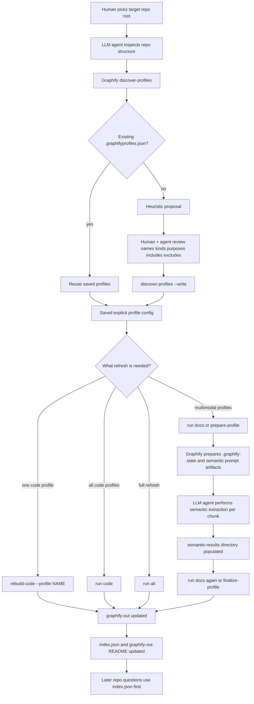
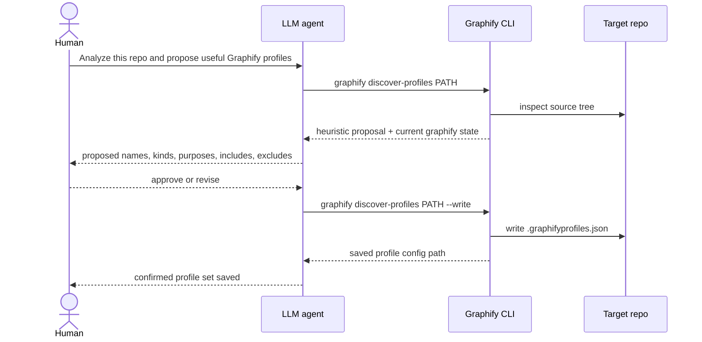
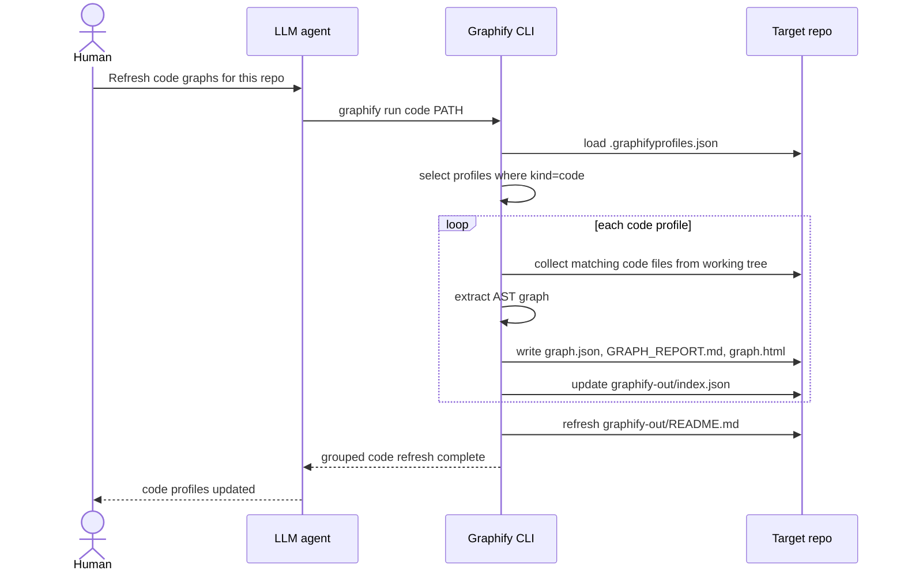
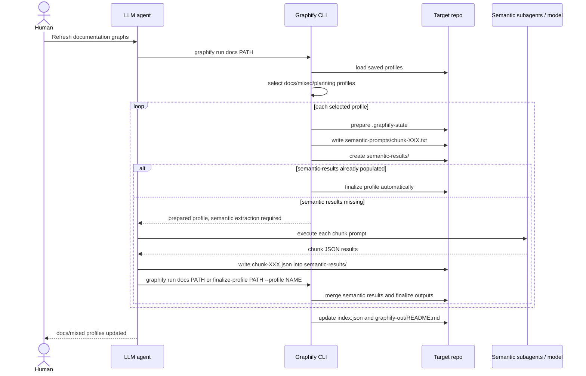
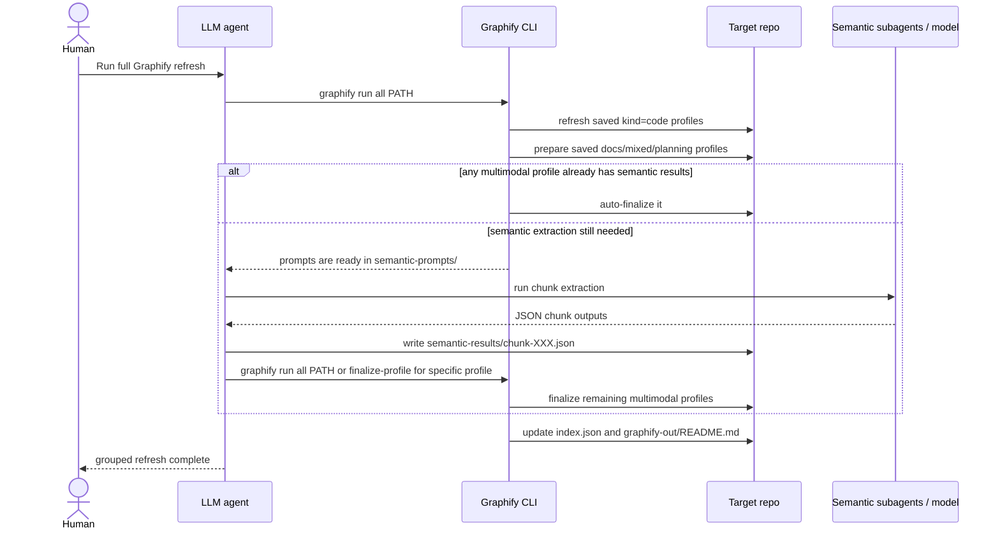
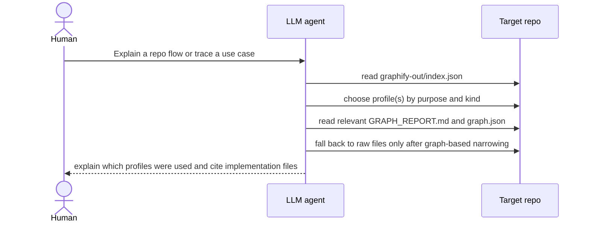

# Graphify Workflow Diagrams

This document traces the current Graphify workflow as implemented in this branch.

It covers:
- what each command does
- where human review and LLM-agent collaboration happen
- what Graphify itself does vs what the assistant does vs what the human does
- what artifacts are written into the target repo
- where the current implementation still depends on human or assistant judgment

This is intentionally based on the current code and current intended process, not an idealized future state.

## Actors

- `Human`
  - decides what repo to analyze
  - reviews and confirms profile proposals
  - resolves ambiguous architectural intent
- `LLM agent`
  - inspects repo structure
  - proposes profiles, names, purposes, and kinds
  - uses Graphify outputs later to answer repo questions
  - performs semantic extraction when multimodal profiles need it
- `Graphify CLI/runtime`
  - discovers files
  - proposes heuristic profiles
  - validates and saves standardized profile config
  - builds code graphs
  - prepares multimodal profile state
  - finalizes multimodal graphs from semantic results
- `Target repo`
  - supplies the source files
  - stores `.graphifyprofiles.json`
  - stores `graphify-out/`
- `Model / semantic subagents`
  - extract semantic relationships for docs, papers, images, and mixed corpora

## Standard Artifacts

### Target-repo config

- `.graphifyprofiles.json`
  - standardized persisted config
  - currently supports:
    - `kind`
    - `purpose`
    - `includes`
    - `excludes`

### Target-repo outputs

- `graphify-out/index.json`
  - assistant entry point
- `graphify-out/README.md`
  - human + assistant usage guide
- `graphify-out/<profile>/graph.json`
  - raw graph data
- `graphify-out/<profile>/GRAPH_REPORT.md`
  - graph summary
- `graphify-out/<profile>/graph.html`
  - HTML viewer
- `graphify-out/<profile>/graph.graphml`
  - optional export for external graph tools

### Multimodal handoff state

- `graphify-out/<profile>/.graphify-state/detection.json`
- `graphify-out/<profile>/.graphify-state/ast.json`
- `graphify-out/<profile>/.graphify-state/semantic-prep.json`
- `graphify-out/<profile>/.graphify-state/semantic-prompts.json`
- `graphify-out/<profile>/.graphify-state/semantic-prompts/chunk-XXX.txt`
- `graphify-out/<profile>/.graphify-state/semantic-prompts/chunk-XXX.json`
- `graphify-out/<profile>/.graphify-state/semantic-results/chunk-XXX.json`

## Standardized Persisted Profile Format

Anything saved into `.graphifyprofiles.json` should be standardized.

- `name`
  - lowercase, hyphenated, architecture-oriented
- `kind`
  - one of:
    - `code`
    - `docs`
    - `mixed`
    - `planning`
- `purpose`
  - one concise sentence
  - describes what the profile is for
- `includes`
  - ordered repo-relative patterns
- `excludes`
  - ordered repo-relative patterns

The collaboration step may be flexible, but the saved artifact should not be.

## Current Important Constraint

Graphify can infer profiles and kinds, but inference is only a first draft.

That means:
- deterministic heuristics can propose
- the human and LLM agent should review
- the confirmed result should be written explicitly
- later grouped commands should rely on the saved explicit config, not repeated guesswork

This matters because real repos vary widely in naming and structure.

## High-Level Command Variants

### Variant A: `graphify discover-profiles PATH`

Purpose:
- inspect the repo
- propose profiles
- do not write anything unless `--write` is used

Human collaboration point:
- review profile names
- review `kind`
- review `purpose`
- review `includes` / `excludes`

### Variant B: `graphify discover-profiles PATH --write`

Purpose:
- persist the confirmed proposal into `.graphifyprofiles.json`

Human collaboration point:
- this should happen only after review

### Variant C: `graphify build-profiles PATH`

Purpose:
- save a first-time discovered profile proposal if needed
- rebuild all saved code-oriented profiles using the fast code path

Current limitation:
- this is code-oriented in practice

### Variant D: `graphify rebuild-code PATH --profile NAME`

Purpose:
- refresh one saved code profile directly

No collaboration expected:
- should use the existing saved config

### Variant E: `graphify run code PATH`

Purpose:
- refresh all saved profiles whose `kind` is `code`

Expected use:
- fast grouped code refresh in an already-configured repo

### Variant F: `graphify run docs PATH`

Purpose:
- prepare all saved `docs`, `mixed`, and `planning` profiles
- auto-finalize any whose standard `semantic-results/` directory already contains results

Collaboration point:
- the LLM agent typically performs semantic extraction between prepare and finalize

### Variant G: `graphify run all PATH`

Purpose:
- run code profiles first
- then run docs/mixed/planning profiles

### Variant H: `graphify prepare-profile PATH --profile NAME`

Purpose:
- prepare one multimodal profile manually
- generate prompt artifacts and standard results directory

### Variant I: `graphify finalize-profile PATH --profile NAME`

Purpose:
- finalize one prepared multimodal profile
- by default reads the standard `semantic-results/` directory if `--semantic` is omitted

## End-to-End Current Workflow



## Collaboration Boundaries By Stage

### 1. Initial repo analysis

Human:
- chooses the repo
- states intent

LLM agent:
- inspects repo layout
- identifies likely architectural slices

Graphify:
- can provide a heuristic proposal

Decision basis:
- repo structure
- likely future navigation/use cases
- whether code and docs need separate treatment

### 2. Profile review

Human:
- challenges weak names or boundaries
- decides what matters for later agent use

LLM agent:
- proposes improvements
- identifies gaps and overlaps
- recommends `kind`

Graphify:
- validates standardized shape when writing config

Decision basis:
- architectural usefulness
- future refresh behavior
- later cross-profile tracing needs

### 3. Persisting `.graphifyprofiles.json`

Human:
- confirms the proposal

LLM agent:
- converts reviewed proposal into standardized config

Graphify:
- validates and loads the config

Decision basis:
- confirmed architecture, not heuristic guess alone

### 4. Refreshing outputs

Human:
- requests code-only, docs-only, or full refresh

LLM agent:
- may trigger grouped commands
- may perform semantic extraction for multimodal profiles

Graphify:
- executes deterministic code rebuilds
- prepares multimodal state
- finalizes multimodal outputs

Decision basis:
- saved explicit profile config
- actual files present in the repo working tree

## Sequence Diagrams

### Sequence 1: First-Time Discovery and Review



### Sequence 2: Refresh All Code Profiles



### Sequence 3: Refresh Docs/Mixed Profiles With Semantic Handoff



### Sequence 4: Full Refresh



### Sequence 5: Normal Repo Understanding Later



## Current Basis For Decisions

### What Graphify decides deterministically

- file detection
- path filtering
- output locations
- config validation
- code graph generation
- multimodal state preparation
- multimodal finalization

### What the LLM agent currently helps decide

- whether the heuristic proposal makes sense
- what the right profile names should be
- what `kind` should be for each profile
- what directories should be separated or merged
- which profiles should be used together later for tracing

### What the human currently decides

- repo-level intent
- whether the proposed slices are useful
- whether a profile is too broad or too noisy
- whether documentation/planning should be first-class profiles
- when the proposal is good enough to save

## Current Caveats

### 1. `kind` inference is only a draft

Current code can infer `kind`, but real repos vary too much for that to be trusted blindly.

That means:
- review is required
- the saved explicit `kind` should become authoritative

### 2. Multimodal orchestration is standardized, but not fully internalized

Current state:
- Graphify standardizes prompts and result directories
- grouped commands can auto-finalize when results already exist

Still not fully internal:
- semantic chunk execution itself is still performed by the assistant/model layer
- Graphify does not yet independently dispatch and supervise those semantic chunks end to end

### 3. The working tree is the corpus

Graphify operates on files currently present in the target repo directory, including uncommitted files, subject to:
- `.graphifyignore`
- profile `includes`
- profile `excludes`
- built-in noise filtering

## Recommended Prompt Templates By Stage

### First discovery

```text
Use Graphify to analyze this repo first, not to build everything blindly. Inspect the repo structure, propose the graph profiles that would be most useful, and explain:
1. which profiles should exist
2. what each profile is for
3. which directories/files belong in each profile
4. whether each profile should be code, docs, mixed, or planning
Do not write the profile config yet. Show the proposal for review first.
```

### Review

```text
Review the proposed Graphify profiles with me. Challenge weak profile boundaries, naming, or kind classification where needed. We want a practical set of profiles for later agent use, not just a heuristic split. After review, produce the final confirmed profile definitions.
```

### Save confirmed config

```text
Write the confirmed Graphify profile configuration for this repo, including explicit profile kind, purpose, includes, and excludes. Then show me the final saved profile set before building outputs.
```

### Refresh code

```text
Use Graphify to refresh the saved code-oriented profiles for this repo. Generate the normal outputs, including graph.html where supported, and then verify graphify-out/index.json reflects the updated outputs.
```

### Refresh docs

```text
Use Graphify to refresh the saved docs/mixed/planning profiles for this repo. Prepare the multimodal runs, execute the semantic extraction workflow, finalize the outputs, and verify graphify-out/index.json and graphify-out/README.md are current.
```

### Full refresh

```text
Run a full Graphify refresh for this repo using the saved profiles. Refresh code-oriented profiles first, then docs/mixed/planning profiles, including HTML outputs where supported. Verify the outputs and summarize what was updated.
```

### Use existing outputs for repo understanding

```text
Use Graphify first. Read graphify-out/index.json, choose the relevant profile outputs, and explain which profiles you used before falling back to raw file search.
```

## Summary

Current Graphify is best understood as a collaboration system:

- Graphify provides the deterministic execution engine and standardized artifacts
- the LLM agent provides architectural interpretation and semantic extraction
- the human provides repo-purpose judgment and final confirmation

That collaboration is strongest at:
- first profile discovery
- profile kind confirmation
- cross-profile tracing for real repo questions

And it is intentionally weakest at:
- pretending that every repo can be correctly classified by naming heuristics alone
