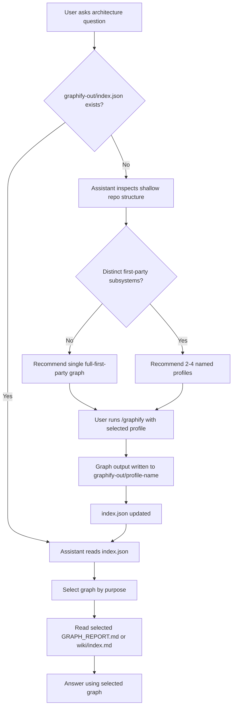
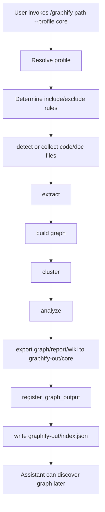
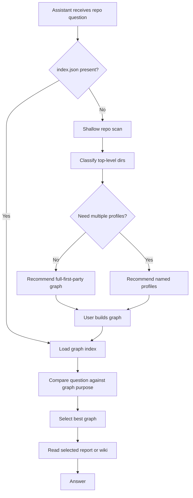

# Multi-Graph Profiles Design

This document describes a proposed design for supporting multiple graph views per repository in Graphify.

The goal is to make Graphify useful for repositories that contain multiple distinct first-party concerns, without forcing everything into one noisy graph.

Examples:

- runtime application code vs training pipeline
- backend vs frontend
- production system vs docs-ingestion pipeline
- testing harness vs core product code

The design below focuses on:

1. user-facing workflow
2. assistant behavior
3. internal library/function flow
4. a staged rollout path that minimizes disruption to the existing single-graph model

## Problem

Today, Graphify is centered around a single output location:

```text
graphify-out/
  graph.json
  GRAPH_REPORT.md
  graph.html
  wiki/
```

That works well for cohesive repositories, but breaks down when:

- the repository contains several mostly independent first-party subsystems
- one subsystem dominates the graph even when the user is asking about another
- top "god nodes" reflect the wrong architectural question

Example:

- If the question is "How does the runtime system work?", a large `training/` directory may be legitimate first-party code but still be the wrong thing to center.
- If the question is "How does the training pipeline work?", excluding `training/` would be incorrect.

So the problem is not simply inclusion vs exclusion.
The problem is that one graph is being asked to answer multiple different architectural questions.

## Design Principle

Multiple graphs should be treated as multiple architectural views of the same repository.

Each graph exists to answer a different question.

Examples:

- `core`: runtime and operational architecture
- `training`: training/data/fine-tuning subsystem
- `full-first-party`: broad first-party repo map

The assistant should choose the graph based on the user’s question, not by reading random files first.

## User Experience

From a user perspective, this should feel like selecting a graph view for a purpose.

Example future commands:

```bash
/graphify . --profile core
/graphify . --profile training
/graphify . --profile full-first-party
```

Example output layout:

```text
graphify-out/
  index.json
  core/
    graph.json
    GRAPH_REPORT.md
    wiki/index.md
  training/
    graph.json
    GRAPH_REPORT.md
  full-first-party/
    graph.json
    GRAPH_REPORT.md
```

The assistant then reads `graphify-out/index.json` first and selects the most appropriate graph before answering.

## Assistant Behavior

The assistant should not guess profile structure blindly.

It should follow a staged decision process:

1. If `graphify-out/index.json` exists, read it first.
2. If profiles already exist, choose the graph whose purpose best matches the question.
3. If no index exists, do a shallow repository-structure analysis.
4. Only propose multiple profiles if the repo has genuinely distinct first-party subsystems.
5. If the repo is cohesive, prefer a single `full-first-party` graph.

## Profile Discovery Heuristic

When no graph index exists, the assistant should inspect only shallow structure first:

- top-level directories
- root config files
- repository README
- obvious generated/vendor/cache directories

The assistant should classify top-level directories into categories like:

- core product/runtime
- testing
- training/data/ML
- docs/content/knowledge
- tooling/build/devops
- third-party/generated/cache

Then it should decide whether separate profiles are justified.

### Default exclusion rule

Exclude by default:

- `node_modules`
- `venv`, `.venv`
- `__pycache__`
- `dist`, `build`
- `graphify-out`
- logs, reports, caches

Do not exclude first-party code just because it is large.

Instead:

- exclude if third-party/generated/cache/environment-specific
- split into a separate profile if first-party but conceptually distinct

## Initial Profile Strategy

A practical starting set for many repos:

### `core`

Use for:

- runtime architecture
- operational code paths
- main abstractions and services

Include:

- app/runtime/source directories
- tests and utilities that belong to the same operational story
- root orchestration scripts if they participate in the runtime flow

Exclude:

- training pipelines
- generated/vendor/cache directories

### `training`

Use for:

- training/data generation
- fine-tuning
- validation and model preparation

Include:

- training/data/ML directories
- shared utilities actually used by that subsystem

Exclude:

- runtime-only subsystems
- generated/vendor/cache directories

### `full-first-party`

Use for:

- whole-repo orientation
- cross-subsystem analysis
- first-party architectural overview

Include:

- all first-party code

Exclude:

- third-party/generated/cache directories

## Why an Index Is Needed

If multiple graphs are supported, assistants and future CLI features need one canonical place to discover them.

That is the purpose of:

```text
graphify-out/index.json
```

The index should answer:

- what graph variants exist?
- where are their files?
- what are they for?
- what did they include/exclude?

This is different from the existing incremental extraction manifest in `graphify-out/manifest.json`.

The existing manifest is about changed files and incremental updates.
The new index is about graph variants and graph discovery.

These should remain separate concepts.

## Proposed Index Shape

Example:

```json
{
  "version": 1,
  "graphs": {
    "core": {
      "name": "core",
      "output_dir": "graphify-out/core",
      "graph_path": "graphify-out/core/graph.json",
      "report_path": "graphify-out/core/GRAPH_REPORT.md",
      "wiki_index_path": "graphify-out/core/wiki/index.md",
      "purpose": "Runtime and operational architecture",
      "includes": ["src", "tests", "utils"],
      "excludes": ["training", "node_modules", "graphify-out"]
    },
    "training": {
      "name": "training",
      "output_dir": "graphify-out/training",
      "graph_path": "graphify-out/training/graph.json",
      "report_path": "graphify-out/training/GRAPH_REPORT.md",
      "wiki_index_path": null,
      "purpose": "Training and data pipeline",
      "includes": ["training"],
      "excludes": ["node_modules", "graphify-out"]
    }
  }
}
```

## Rollout Plan

The clean rollout is incremental.

### Phase 1: Foundation

Add a library-level graph index helper:

- load graph index
- save graph index
- register graph output

This phase does not need to change the existing single-graph behavior.

### Phase 2: User-facing profiles

Add profile-aware generation:

```bash
/graphify . --profile core
/graphify . --profile training
/graphify . --profile full-first-party
```

Each profile writes into its own subdirectory and registers itself in the index.

### Phase 3: Assistant-aware graph selection

Update assistant instructions so they:

1. read `graphify-out/index.json` if present
2. choose the graph whose purpose matches the question
3. only fall back to raw files if the chosen graph is insufficient

### Phase 4: Optional profile discovery helper

Add a deterministic helper such as:

```python
discover_profiles(root: Path) -> dict
```

This would inspect top-level structure and return candidate profiles plus reasons.

This would help assistants propose profiles consistently rather than inventing them ad hoc.

## User-Level Flow



## Function-Level Flow

This diagram shows the desired library/orchestration interaction.



## Assistant Discovery Flow

This diagram focuses on the assistant-side selection logic.



## Why This Is Better Than One Giant Graph

A single graph is still useful for cohesive repos.

But for larger or mixed-concern repos, one graph often:

- answers the wrong question
- surfaces the wrong god nodes
- mixes unrelated concerns
- reduces trust in the output

Multiple graph views improve:

- question-to-graph alignment
- assistant navigation
- user trust
- future composability

## Why This Should Be Incremental

The main build flow is currently orchestrated largely through the Graphify skill instructions rather than a full Python build CLI.

That means the least disruptive path is:

1. establish the library contract first
2. then add user-facing profile generation
3. then teach assistants to consume the result

This avoids:

- large CLI changes all at once
- assistant instructions that depend on an unstable format
- tightly coupling profile discovery to one platform-specific skill path

## Open Questions

1. Should profile definitions be explicit CLI inputs only, or should Graphify also support auto-discovery?
2. Should a repo have one designated default graph in the index?
3. Should `graphify-out/GRAPH_REPORT.md` remain the default single-graph location while profile graphs live under subdirectories?
4. Should the assistant always prefer a profile graph when available, or fall back to a default graph first?

## Recommended Next Step

The best next implementation step is:

- keep the index/registry foundation
- add one user-facing profile workflow
- probably start with:
  - `core`
  - `full-first-party`

That makes the feature real from a user perspective without overcommitting to too many profile types too early.
